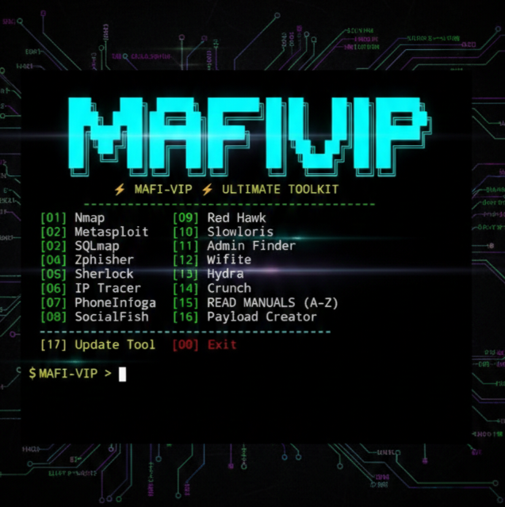

<p align="center">
  <kbd>
    
  </kbd>
</p>

<p align="center">
  <a href="https://git.io/typing-svg">
    
  </a>
</p>

<p align="center">
  
  
  
</p>

<p align="center">
  
</p>

## 📖 හැඳින්වීම (Introduction)

**MAFI-VIP** යනු Termux සඳහා විශේෂයෙන් නිර්මාණය කරන ලද, Tools 16කට අධික ප්‍රමාණයක් එකම තැනකින් ලබාගත හැකි ඉතා බලවත් Toolkit එකකි. මෙහි ඇති විශේෂත්වය වන්නේ සෑම Tool එකක්ම භාවිතා කරන ආකාරය (A-Z Manuals) මෙහිම ඇතුළත් කර තිබීමයි.

---

## 🚀 විශේෂාංග (Features)

* 🔒 **Login System:** පද්ධතියේ ආරක්ෂාව සඳහා Password ආරක්ෂාවක් ඇත.
* 🛠️ **16+ Tools:** Phishing, Scanning, Brute force සහ OSINT ටූල්ස්.
* 📚 **Auto-Manuals:** ටූල්ස් භාවිතා කරන ආකාරය පියවරෙන් පියවර උපදෙස් ගොනු.
* 🎨 **User Friendly:** සරල සහ ආකර්ෂණීය UI එකක් සහිතයි.

---

## 🛠️ ඇතුළත් ටූල්ස් (Tools Included)

| Tool Name | Purpose | Status |
| :--- | :--- | :--- |
| **Nmap** | Port Scanning | ✅ |
| **Metasploit** | Exploitation | ✅ |
| **SQLmap** | Database Hack | ✅ |
| **Zphisher** | Advanced Phishing | ✅ |
| **Sherlock** | Social Media Lookup | ✅ |
| **Crunch** | Wordlist Generator | ✅ |
| **Hydra** | Brute Force | ✅ |

---

## screenshot

<p align="center">
  <kbd>
    
  </kbd>
</p>


## 📥 ස්ථාපනය කරන ආකාරය (Installation)

පහත විධානයන් (Commands) පිළිවෙළින් ඔබගේ Termux එකෙහි ටයිප් කරන්න:

```bash
pkg update && pkg upgrade -y
pkg install python git -y
git clone [https://github.com/Achiachiofficial/MAFI-VIP-.git](https://github.com/Achiachiofficial/MAFI-VIP-.git)
cd MAFI-VIP-
python ultimate.py
```
## 🔑 Login Key ලබා ගැනීම
​මෙම ටූල් එක භාවිතා කිරීමට අවශ්‍ය Login Key එක ලබා ගැනීමට Admin අමතන්න.


## ​👨‍💻 Developer Information
​<p align="center">
<b>ACHI_flash</b>

<i>Lead Developer</i>

<a href="https://www.google.com/search?q=https://github.com/Achiachiofficial">

</a>
</p>

### ​📊 Repository Status
​<p align="center">

</p>
​[!CAUTION]


**⚠️Disclaimer**: මෙම ටූල් එක අධ්‍යාපනික කටයුතු සඳහා පමණක් භාවිතා කරන්න. මෙහි වැරදි භාවිතය සම්බන්ධයෙන් නිර්මාණකරු වගකීමක් නොදරයි.
​<p align="center">
<b>Made with ❤️ by Achiachi</b>


</p>
